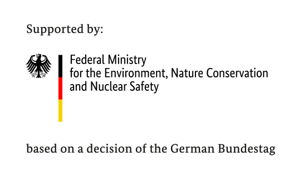

# IKI Oasis Bangladesh

<!-- Github Sheilds -->
<!-- https://shields.io/ is a good source of these -->

</a>

</a>

    

 

## Overview
This repositry contains code accompyning articles [TBC] and [TBC].  It is part of the [Oasis Platform for Climate and Catastrophe Risk Assessment – Asia](https://www.international-climate-initiative.com/en/nc/details/project/oasis-platform-for-climate-and-catastrophe-risk-assessment-asia-18_II_165-3018), a project funded by the [International Climate Initiative (IKI)](https://www.international-climate-initiative.com/en), supported by the Federal Ministry for the Environment, Nature Conservation and Nuclear Safety, based on a decision of the German Bundestag.

## Data
Data relating to this project is available from [TBC]

## Licence
All code and data relating to this project is licenced under CC-BY-4.0

<h5 align="center">
   
</h5>
